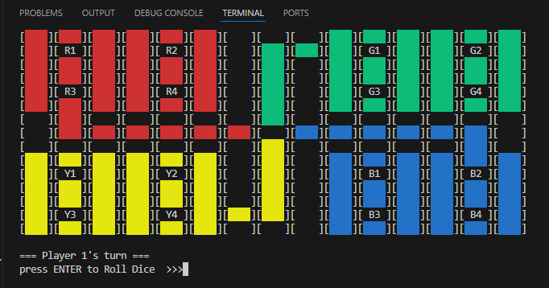

# Ludo-in-Terminal-using-C-


## 🎲 Ludo Console Game (C++)

A simple **console-based Ludo simulation** written entirely in **C++**. 
The game uses **object-oriented programming** (OOP) principles with separate files for classes, functions, and the main game loop, ensuring a clean and modular structure.



---

## 🧩 Features

* **Color-coded Board:** Uses ANSI escape codes for a visually clear board representation.
* **Independent Pawns:** Separate classes (`PawnR`, `PawnG`, `PawnB`, `PawnY`) for independent pawn logic.
* **True Random Dice:** Dice roll simulation using `std::mt19937` for robust random number generation.
* **Turn-Based System:** Handles player switching (Red, Green, Blue, Yellow) and turn management.
* **Modular Design:** Clean code separation makes the system easy to extend for full gameplay mechanics.

---

## 🗂️ Project Structure


📁 Ludo-CPP/ <break>  
├── classes.h        \# All pawn class declarations <break>  
├── classes.cpp        \# Pawn class implementations <break>  
├── functions.h        \# Function declarations & global variables <break>  
├── functions.cpp      \# Function definitions (game logic, dice roll, drawing, etc.)  <break>  
├── main.cpp           \# Main game loop and player turns logic <break>  
└── README.md          \# Project documentation (this file) <break>  

````

---

## ⚙️ Setup & Compilation

Make sure you have a C++ compiler (e.g., `g++` on Linux/macOS or MinGW on Windows).

### 🔧 Compile the project

Use the following command to compile the source files and create an executable:

```bash
g++ main.cpp functions.cpp classes.cpp -o ludo
````

### ▶️ Run the game

Execute the compiled file from your terminal:

```bash
./ludo
```

-----

## 🕹️ Gameplay & Current State

This version primarily focuses on the **movement logic** and **turn handling** within the console.

Each player (Red, Green, Blue, Yellow) takes turns rolling the dice. The board updates dynamically with pawn positions. The final version will include full features like:

  * Releasing pawns from the starting area.
  * Moving pawns across the full board path.
  * Reaching the home area to win.

-----

## 🧠 Future Improvements

  * Implement the **full movement path logic** for all four colors.
  * Introduce **"safe zones"** and **"attack logic"**.
  * Fix last tile issue when moving.


-----


<!-- end list -->


